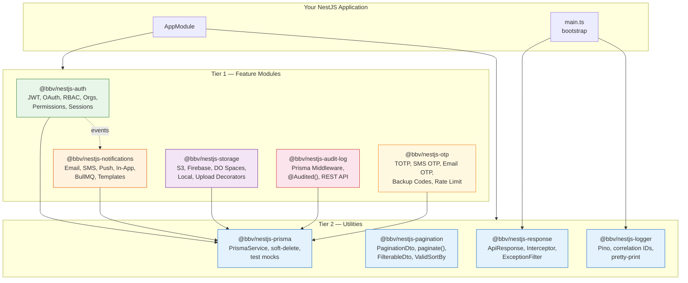
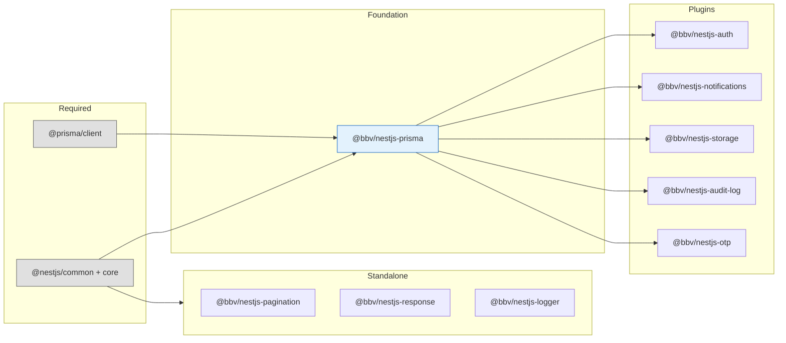
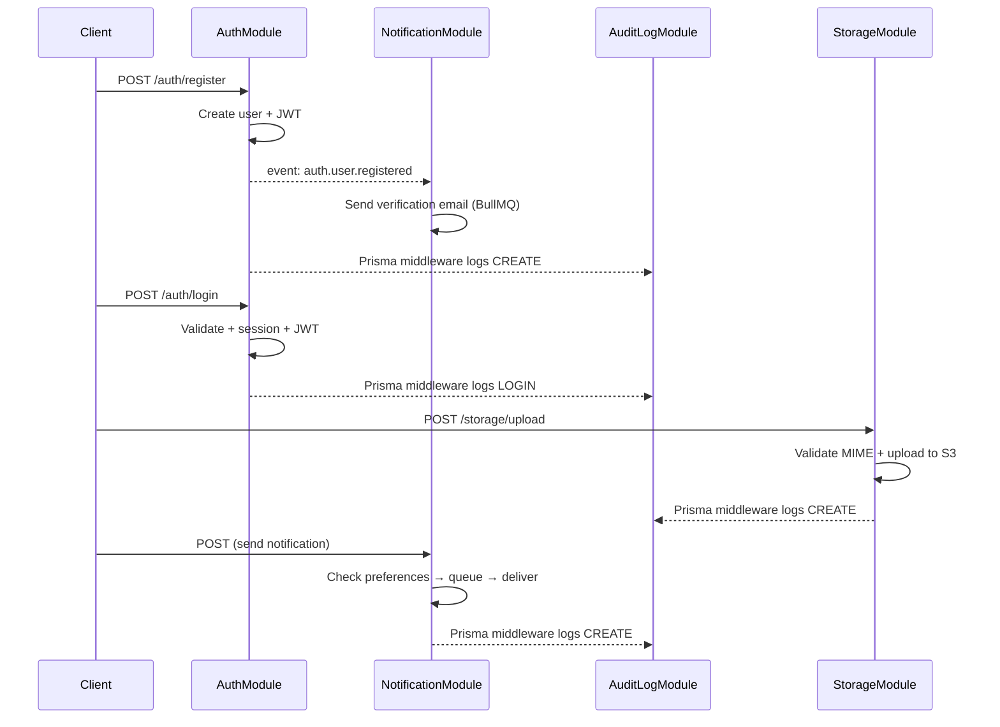

# @bbv/nestjs-plugins

> Composable NestJS plugin ecosystem -- drop-in modules for auth, notifications, storage, audit logging, OTP, pagination, structured logging, and API response standardization.

## Why

Building a production NestJS API means wiring up the same concerns every time: authentication, file uploads, email delivery, audit trails, pagination. This monorepo ships each concern as an independent, feature-flagged module with its own Prisma schema. Enable what you need, disable what you don't -- unused features register zero routes and zero providers.

## Packages

### Tier 1 -- Feature Modules

Self-contained modules with Prisma schemas, REST endpoints, and provider abstraction.

| Package | Description | Providers |
|---------|-------------|-----------|
| [`@bbv/nestjs-auth`](packages/nestjs-auth) | Auth (email/password, Google OAuth, RBAC, orgs, permissions) | JWT, Local, Google, Apple, Microsoft |
| [`@bbv/nestjs-notifications`](packages/nestjs-notifications) | Multi-channel notifications (email, SMS, push, in-app) | SMTP, SendGrid, Twilio, Firebase |
| [`@bbv/nestjs-storage`](packages/nestjs-storage) | File upload with MIME validation and tracking | S3, Firebase, DO Spaces, Local |
| [`@bbv/nestjs-audit-log`](packages/nestjs-audit-log) | Automatic CRUD audit logging via Prisma middleware | Prisma middleware |
| [`@bbv/nestjs-otp`](packages/nestjs-otp) | OTP verification (TOTP, SMS, email) with backup codes | TOTP, SMS, Email |

### Tier 2 -- Utilities

Standalone utilities -- no module registration required (except Logger).

| Package | Description |
|---------|-------------|
| [`@bbv/nestjs-prisma`](packages/nestjs-prisma) | Prisma lifecycle management, soft-delete middleware, `createMockPrismaService()` for testing |
| [`@bbv/nestjs-pagination`](packages/nestjs-pagination) | `PaginationDto`, `paginate()` helper, `FilterableDto`, `@ValidSortBy()`, `@ApiPaginatedResponse()` |
| [`@bbv/nestjs-response`](packages/nestjs-response) | `ApiResponse` wrapper, `TransformInterceptor`, `HttpExceptionFilter` |
| [`@bbv/nestjs-logger`](packages/nestjs-logger) | Structured Pino logging with correlation IDs and pretty-print |

## Architecture



## Dependency Graph



## Module Interaction Flow



## How It Works

### Feature Flags

Every plugin module accepts a `features` config to toggle capabilities. Disabled features don't register routes, don't consume resources, and throw if called directly.

```typescript
AuthModule.forRootAsync({
  useFactory: () => ({
    jwt: { secret: 'my-secret' },
    features: {
      emailPassword: true,     // POST /auth/register, POST /auth/login
      google: false,            // Google OAuth routes not registered
      organizations: true,      // Full /organizations CRUD
      sessionManagement: false,  // Session endpoints not registered
    },
  }),
})
```

### Provider Abstraction

Modules with swappable backends follow the same config pattern with TypeScript discriminated unions for type safety:

```typescript
// Storage: swap S3 for local disk
StorageModule.forRoot({
  provider: 'local',              // or 's3', 'firebase', 'do_spaces'
  providerOptions: { directory: './uploads' },
})

// Notifications: swap SMTP for SendGrid
NotificationModule.forRoot({
  channels: {
    email: {
      enabled: true,
      provider: 'sendgrid',       // or 'smtp'
      providerOptions: { apiKey: 'SG.xxx', from: 'noreply@app.com' },
    },
  },
})
```

### Multi-File Prisma Schema

Each Tier 1 plugin ships a `.prisma` file. Copy them into your project's schema directory:

```
prisma/schema/
  base.prisma           # datasource + generator (with prismaSchemaFolder)
  auth.prisma           # from @bbv/nestjs-auth
  notifications.prisma  # from @bbv/nestjs-notifications
  storage.prisma        # from @bbv/nestjs-storage
  audit.prisma          # from @bbv/nestjs-audit-log
  otp.prisma            # from @bbv/nestjs-otp
  app.prisma            # your project-specific models
```

`base.prisma`:
```prisma
generator client {
  provider        = "prisma-client-js"
  previewFeatures = ["prismaSchemaFolder"]
}

datasource db {
  provider = "postgresql"
  url      = env("DATABASE_URL")
}
```

### Permissions System

Platform-level RBAC with wildcard matching and organization-scoped authorization:

```typescript
AuthModule.forRootAsync({
  useFactory: () => ({
    jwt: { secret: 'my-secret' },
    permissions: {
      rolePermissions: {
        admin: ['*'],                    // full access
        owner: ['org:*', 'items:*'],     // org + items access
        user: ['items:read', 'items:create'],
      },
      superAdminRoles: ['admin'],
    },
  }),
})
```

Guards:
- **`PermissionsGuard`** -- checks platform-level permissions via `@Permissions('items:read')`
- **`OrgMemberGuard`** -- checks org membership via `@OrgRoles('owner', 'admin')`

## Quick Start

### 1. Install packages

```bash
npm install @bbv/nestjs-prisma @bbv/nestjs-auth @bbv/nestjs-response @bbv/nestjs-logger
# Add more as needed:
npm install @bbv/nestjs-storage @bbv/nestjs-notifications @bbv/nestjs-audit-log @bbv/nestjs-otp
```

### 2. Configure your app module

```typescript
import { Module } from '@nestjs/common';
import { ConfigModule, ConfigService } from '@nestjs/config';
import { PrismaModule } from '@bbv/nestjs-prisma';
import { AuthModule } from '@bbv/nestjs-auth';
import { LoggerModule } from '@bbv/nestjs-logger';

@Module({
  imports: [
    ConfigModule.forRoot({ isGlobal: true }),
    PrismaModule.forRoot({ isGlobal: true }),
    LoggerModule.forRoot({ prettyPrint: process.env.NODE_ENV !== 'production' }),

    AuthModule.forRootAsync({
      useFactory: (config: ConfigService) => ({
        jwt: {
          secret: config.getOrThrow('JWT_SECRET'),
          expiresIn: '7d',
        },
        features: {
          emailPassword: true,
          organizations: true,
        },
      }),
      inject: [ConfigService],
    }),
  ],
})
export class AppModule {}
```

### 3. Bootstrap with logger and response handling

```typescript
import { NestFactory } from '@nestjs/core';
import { ValidationPipe } from '@nestjs/common';
import { Logger } from 'nestjs-pino';
import { TransformInterceptor, HttpExceptionFilter } from '@bbv/nestjs-response';

async function bootstrap() {
  const app = await NestFactory.create(AppModule, { bufferLogs: true });
  app.useLogger(app.get(Logger));
  app.useGlobalPipes(new ValidationPipe({ whitelist: true, transform: true }));
  app.useGlobalInterceptors(new TransformInterceptor());
  app.useGlobalFilters(new HttpExceptionFilter());
  await app.listen(3000);
}
bootstrap();
```

### 4. Copy Prisma schemas and migrate

```bash
cp node_modules/@bbv/nestjs-auth/prisma/auth.prisma prisma/schema/
npx prisma generate && npx prisma migrate dev
```

## Development

### Prerequisites

- Node.js >= 20
- Docker (for e2e tests -- Postgres, Redis, MinIO, SMTP)

### Commands

| Command | Description |
|---------|-------------|
| `npm install` | Install all dependencies |
| `npm run build` | Build all packages (via Turbo) |
| `npm run test` | Run all unit tests |
| `npm run test:cov` | Run tests with coverage |
| `npm run typecheck` | Type-check all packages |
| `npm run lint` | Lint all packages |
| `npm run format` | Format with Prettier |
| `npm run clean` | Clean dist/coverage |

### Target a single package

```bash
npx turbo run test --filter=@bbv/nestjs-auth
npx turbo run build --filter=@bbv/nestjs-notifications
```

### Run e2e tests

```bash
npm run test:e2e --workspace=apps/demo
```

This starts Docker services (Postgres, Redis, MinIO, SMTP), pushes the Prisma schema, and runs the full e2e suite.

### Demo app

The `apps/demo` directory contains a fully wired NestJS app with all plugins enabled, Swagger UI at `http://localhost:3000/api`, and Docker Compose for local dependencies.

## Repository Structure

```
bbv-nestjs-packages/
  apps/
    demo/                    # Demo NestJS app (all plugins wired)
  packages/
    nestjs-prisma/           # Prisma lifecycle + test mocks
    nestjs-pagination/       # PaginationDto + paginate() + filtering
    nestjs-response/         # ApiResponse wrapper + filters
    nestjs-logger/           # Structured Pino logging
    nestjs-auth/             # Auth + RBAC + Orgs + Permissions
    nestjs-notifications/    # Email + SMS + Push + In-App
    nestjs-storage/          # File upload + S3/Firebase/Local
    nestjs-audit-log/        # CRUD audit logging
    nestjs-otp/              # TOTP + SMS/Email OTP
```

## Tech Stack

| Layer | Technology |
|-------|-----------|
| Runtime | Node.js >= 20 |
| Framework | NestJS 10 |
| ORM | Prisma 5/6 (multi-file schema) |
| Language | TypeScript 5.4+ (strict) |
| Build | `tsc` per package |
| Test | Jest 29 with `ts-jest` |
| Monorepo | Turborepo + npm workspaces |
| Lint | ESLint + `@typescript-eslint/strict` |
| Format | Prettier |
| Versioning | Changesets (independent) |

## Contributing

1. Fork the repository
2. Create your feature branch (`git checkout -b feat/my-feature`)
3. Commit using [Conventional Commits](https://www.conventionalcommits.org/) (`feat(nestjs-auth): add Apple OAuth`)
4. Run `npm run test && npm run typecheck && npm run lint`
5. Open a Pull Request

We use [Changesets](https://github.com/changesets/changesets) for versioning. Add a changeset with `npx changeset` before submitting your PR.

## License

[MIT](LICENSE) -- [BlackBox Vision](https://github.com/BlackBoxVision)
