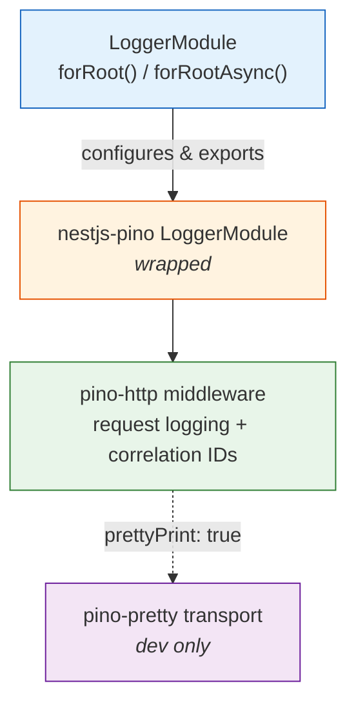

# @bbv/nestjs-logger

> Structured logging module for NestJS using Pino with correlation IDs and pretty-print support.

## Overview

Thin wrapper around [`nestjs-pino`](https://github.com/iamolegga/nestjs-pino) that provides sensible defaults for structured JSON logging in production and pretty-printed output in development. Automatically generates correlation IDs from `X-Request-Id` headers (or creates new UUIDs), so every log line can be traced back to its originating HTTP request.

Existing `new Logger()` calls throughout the codebase work automatically -- NestJS delegates to Pino once `app.useLogger()` is configured.

## Installation

```bash
npm install @bbv/nestjs-logger
```

### Peer Dependencies

| Package | Version |
|---------|---------|
| `@nestjs/common` | `^10.0.0` |
| `@nestjs/core` | `^10.0.0` |

### Dependencies

`nestjs-pino` `^4.0.0`, `pino-http` `^10.0.0`, `pino-pretty` `^11.0.0`

## Quick Start

### 1. Import the module

```typescript
import { Module } from '@nestjs/common';
import { LoggerModule } from '@bbv/nestjs-logger';

@Module({
  imports: [
    LoggerModule.forRoot({
      level: 'info',
      prettyPrint: process.env.NODE_ENV !== 'production',
    }),
  ],
})
export class AppModule {}
```

### 2. Configure the app logger

```typescript
import { NestFactory } from '@nestjs/core';
import { Logger } from 'nestjs-pino';

async function bootstrap() {
  const app = await NestFactory.create(AppModule, { bufferLogs: true });
  app.useLogger(app.get(Logger));
  await app.listen(3000);
}
bootstrap();
```

### Async configuration

```typescript
LoggerModule.forRootAsync({
  imports: [ConfigModule],
  useFactory: (config: ConfigService) => ({
    level: config.get('LOG_LEVEL', 'info'),
    prettyPrint: config.get('NODE_ENV') !== 'production',
  }),
  inject: [ConfigService],
})
```

## Configuration

### `LoggerModuleOptions`

| Option | Type | Default | Description |
|--------|------|---------|-------------|
| `level` | `string` | `'info'` | Pino log level (`trace`, `debug`, `info`, `warn`, `error`, `fatal`) |
| `prettyPrint` | `boolean` | `false` | Enable colorized pretty-print output (use in development only) |
| `isGlobal` | `boolean` | `true` | Register module globally |

## Features

### Correlation IDs

Every request is assigned a unique ID, either from the incoming `X-Request-Id` header or generated via `crypto.randomUUID()`. This ID appears in every log line for the request lifecycle, enabling distributed tracing.

### Structured JSON (production)

```json
{"level":30,"time":1709744400000,"pid":1234,"req":{"id":"abc-123","method":"GET","url":"/items"},"msg":"request completed","responseTime":12}
```

### Pretty-print (development)

```
[18:30:00.000] INFO: request completed
    req: { id: "abc-123", method: "GET", url: "/items" }
    responseTime: 12
```

## Architecture



## License

[MIT](../../LICENSE) -- [BlackBox Vision](https://github.com/BlackBoxVision)
