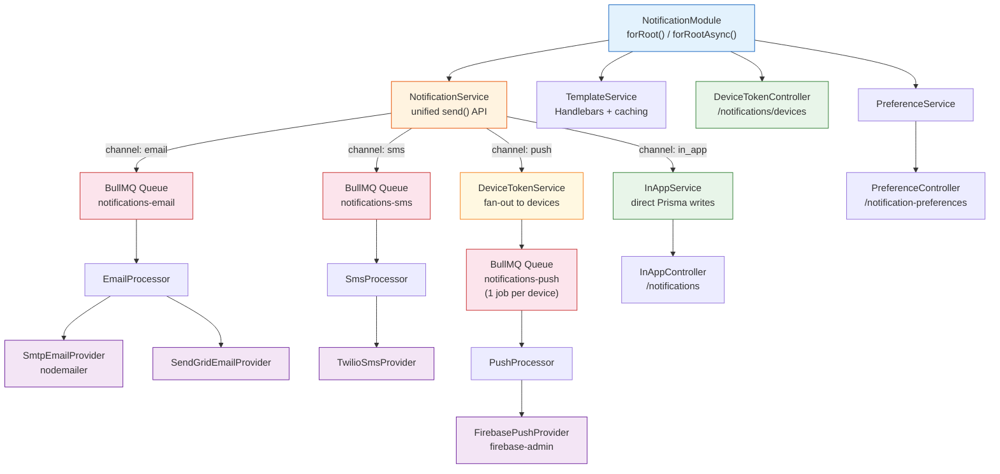

# @bbv/nestjs-notifications

> Multi-channel notification module for NestJS with email, in-app, SMS, and push notification support.

## Overview

Unified notification API with channel routing, provider abstraction, BullMQ queue processing, Handlebars templates, and per-user notification preferences. Send a notification to any channel with a single `send()` call -- the module handles routing, queuing, preference checks, and delivery.

## Installation

```bash
npm install @bbv/nestjs-notifications
```

### Peer Dependencies

| Package | Version |
|---------|---------|
| `@nestjs/common` | `^10.0.0` |
| `@nestjs/core` | `^10.0.0` |
| `@nestjs/bullmq` | `^10.0.0` |
| `@prisma/client` | `^5.0.0 \|\| ^6.0.0` |
| `bullmq` | `^5.0.0` |
| `firebase-admin` | `^12.0.0 \|\| ^13.0.0` *(optional — only if push channel is enabled with Firebase)* |

Requires [`@bbv/nestjs-prisma`](../nestjs-prisma) to be registered first. Redis is required for email, SMS, and push queues.

## Prisma Schema

Copy the notifications schema into your project:

```bash
cp node_modules/@bbv/nestjs-notifications/prisma/notifications.prisma prisma/schema/
npx prisma generate && npx prisma migrate dev
```

**Models provided**:

| Model | Key Fields | Description |
|-------|-----------|-------------|
| `Notification` | `userId`, `channel`, `type`, `title`, `body`, `status`, `readAt?`, `sentAt?` | Notification records |
| `NotificationPreference` | `userId`, `channel`, `type`, `enabled` | Per-user opt-in/opt-out preferences |
| `DeviceToken` | `userId`, `token`, `platform`, `@@unique([userId, token])` | Push notification device token registry |

## Quick Start

```typescript
import { Module } from '@nestjs/common';
import { ConfigService } from '@nestjs/config';
import { NotificationModule } from '@bbv/nestjs-notifications';

@Module({
  imports: [
    NotificationModule.forRootAsync({
      useFactory: (config: ConfigService) => ({
        channels: {
          email: {
            enabled: true,
            provider: 'smtp',
            providerOptions: {
              host: config.get('SMTP_HOST', 'localhost'),
              port: 587,
              from: 'noreply@app.com',
            },
            templateDir: './templates/email',  // optional
          },
          inApp: { enabled: true },
          sms: {
            enabled: true,
            provider: 'twilio',
            providerOptions: {
              accountSid: config.getOrThrow('TWILIO_SID'),
              authToken: config.getOrThrow('TWILIO_TOKEN'),
              from: config.getOrThrow('TWILIO_FROM'),
            },
          },
          push: {
            enabled: true,
            provider: 'firebase',
            providerOptions: {
              serviceAccountKey: JSON.parse(
                config.getOrThrow('FIREBASE_SERVICE_ACCOUNT_KEY'),
              ),
            },
          },
        },
        features: { preferences: true, templates: true },
        queue: { redis: { host: config.get('REDIS_HOST', 'localhost') } },
      }),
      inject: [ConfigService],
    }),
  ],
})
export class AppModule {}
```

## Configuration

### `NotificationModuleOptions`

| Option | Type | Description |
|--------|------|-------------|
| `channels.email` | `EmailChannelConfig` | Email channel config (see providers below) |
| `channels.inApp` | `{ enabled: boolean }` | In-app notification channel |
| `channels.sms` | `SmsChannelConfig` | SMS channel config (see providers below) |
| `channels.push` | `PushChannelConfig` | Push notification channel config (see providers below) |
| `features.preferences` | `boolean` | Enable per-user notification preferences |
| `features.templates` | `boolean` | Enable Handlebars template rendering |
| `queue.redis` | `{ host, port?, password? }` | Redis connection for BullMQ queues |

### Feature Flags

| Flag | Default | Description |
|------|---------|-------------|
| `preferences` | `true` | User notification preferences API + preference checking |
| `templates` | `true` | Handlebars template rendering service |

Channel-level flags are controlled by the `enabled` property on each channel config.

## Sending Notifications

```typescript
import { Injectable } from '@nestjs/common';
import { NotificationService } from '@bbv/nestjs-notifications';

@Injectable()
export class ClaimsService {
  constructor(private readonly notifications: NotificationService) {}

  async approveClaim(claimId: string, userId: string, email: string) {
    // Send email (queued via BullMQ)
    await this.notifications.send({
      userId,
      channel: 'email',
      type: 'claim_approved',
      title: 'Claim Approved',
      body: '<p>Your warranty claim has been approved.</p>',
      to: email,
    });

    // Send in-app notification (immediate)
    await this.notifications.send({
      userId,
      channel: 'in_app',
      type: 'claim_approved',
      title: 'Claim Approved',
      body: 'Your warranty claim has been approved.',
    });

    // Send SMS (queued via BullMQ)
    await this.notifications.send({
      userId,
      channel: 'sms',
      type: 'claim_approved',
      title: 'Claim Approved',
      body: 'Your warranty claim has been approved.',
      to: '+1234567890',
    });

    // Send push to all registered devices (queued via BullMQ, fan-out)
    await this.notifications.send({
      userId,
      channel: 'push',
      type: 'claim_approved',
      title: 'Claim Approved',
      body: 'Your warranty claim has been approved.',
    });
  }
}
```

### `SendNotificationPayload`

| Field | Type | Required | Description |
|-------|------|----------|-------------|
| `userId` | `string` | Yes | Target user ID |
| `channel` | `'email' \| 'in_app' \| 'sms' \| 'push'` | Yes | Delivery channel |
| `type` | `string` | Yes | Notification type (for preferences) |
| `title` | `string` | Yes | Notification title / email subject |
| `body` | `string` | Yes | Notification body / email HTML |
| `data` | `Record<string, unknown>` | No | Arbitrary metadata |
| `to` | `string` | Email/SMS/Push | Recipient address, phone, or device token. For push, omit to fan-out to all user devices |

Returns `{ id: string }` -- the ID of the persisted notification record.

## Email Providers

| Provider | Config Key | Status | Options |
|----------|-----------|--------|---------|
| SMTP | `'smtp'` | Available | `host`, `port`, `secure?`, `auth?`, `from` |
| SendGrid | `'sendgrid'` | Available | `apiKey`, `from` |
| AWS SES | `'ses'` | Planned | `region`, `accessKeyId`, `secretAccessKey`, `from` |
| Resend | `'resend'` | Planned | `apiKey`, `from` |

### SMTP Configuration

```typescript
{
  enabled: true,
  provider: 'smtp',
  providerOptions: {
    host: 'smtp.example.com',
    port: 587,
    secure: false,
    auth: { user: 'user', pass: 'pass' },
    from: 'noreply@app.com',
  },
  templateDir: './templates/email',  // optional
}
```

### SendGrid Configuration

```typescript
{
  enabled: true,
  provider: 'sendgrid',
  providerOptions: {
    apiKey: 'SG.xxx',
    from: 'noreply@app.com',
  },
}
```

## SMS Providers

| Provider | Config Key | Options |
|----------|-----------|---------|
| Twilio | `'twilio'` | `accountSid`, `authToken`, `from` |

```typescript
{
  enabled: true,
  provider: 'twilio',
  providerOptions: {
    accountSid: 'ACxxx',
    authToken: 'xxx',
    from: '+1234567890',
  },
}
```

## Push Providers

| Provider | Config Key | Status | Options |
|----------|-----------|--------|---------|
| Firebase Cloud Messaging | `'firebase'` | Available | `serviceAccountKey` |
| Expo Push | — | Planned | — |
| OneSignal | — | Planned | — |

### Firebase Configuration

Requires `firebase-admin` as a peer dependency:

```bash
npm install firebase-admin
```

```typescript
{
  enabled: true,
  provider: 'firebase',
  providerOptions: {
    serviceAccountKey: {
      // your Firebase service account JSON contents
      projectId: 'my-project',
      clientEmail: '...',
      privateKey: '...',
    },
  },
}
```

Push notifications are queued via BullMQ (`notifications-push` queue) and fan out to all registered device tokens for the target user. Provide an explicit `to` field to target a single device token instead.

## Device Token Endpoints

When push channel is enabled, the following REST endpoints are registered for managing device tokens:

| Method | Path | Body / Params | Description |
|--------|------|---------------|-------------|
| `POST` | `/notifications/devices` | `{ token, platform }` | Register a device token |
| `DELETE` | `/notifications/devices/:token` | — | Unregister a specific device |
| `DELETE` | `/notifications/devices` | — | Unregister all devices (e.g. on logout) |
| `GET` | `/notifications/devices` | — | List all registered devices |

`platform` should be `'android'`, `'ios'`, or `'web'`. All endpoints use `request.user.id` or `request.user.sub` for the current user.

The `DeviceTokenService` is also exported for programmatic use:

```typescript
import { DeviceTokenService } from '@bbv/nestjs-notifications';

@Injectable()
export class AuthService {
  constructor(private readonly deviceTokens: DeviceTokenService) {}

  async logout(userId: string) {
    await this.deviceTokens.unregisterAll(userId);
  }
}
```

## Templates

Uses [Handlebars](https://handlebarsjs.com/) for template rendering. Templates are resolved in order:

1. `templateDir/{channel}/{name}.hbs` (your project templates)
2. `templateDir/{name}.hbs` (flat project templates)
3. Built-in defaults

```typescript
import { TemplateService } from '@bbv/nestjs-notifications';

@Injectable()
export class EmailService {
  constructor(private readonly templates: TemplateService) {}

  renderWelcome(user: { name: string }) {
    return this.templates.render('welcome', 'email', { name: user.name });
  }
}
```

## In-App Notification Endpoints

When `inApp` channel is enabled, the following REST endpoints are registered:

| Method | Path | Description |
|--------|------|-------------|
| `GET` | `/notifications` | List notifications (`?skip`, `?take`, `?status`) |
| `PATCH` | `/notifications/:id/read` | Mark single notification as read |
| `PATCH` | `/notifications/read-all` | Mark all notifications as read |
| `GET` | `/notifications/unread-count` | Get unread notification count |

All endpoints use `request.user.id` or `request.user.sub` for the current user.

## Notification Preferences Endpoints

When `preferences` feature is enabled:

| Method | Path | Description |
|--------|------|-------------|
| `GET` | `/notification-preferences` | Get all user preferences |
| `PUT` | `/notification-preferences` | Upsert a preference (`{ channel, type, enabled }`) |

Preferences are checked automatically before sending. If a user has disabled a channel+type combination, the notification is suppressed.

## Architecture



## License

[MIT](../../LICENSE) -- [BlackBox Vision](https://github.com/BlackBoxVision)
