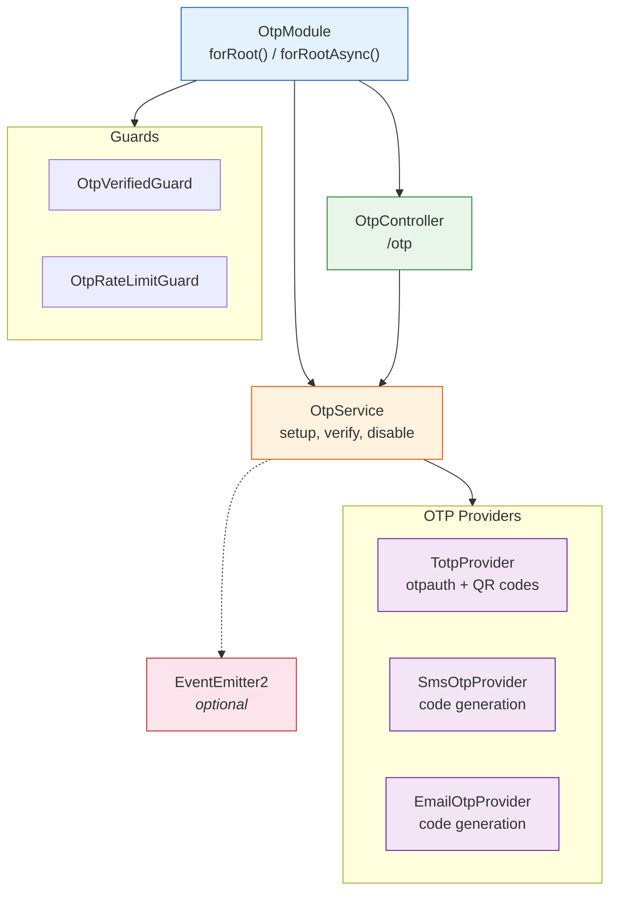

# @bbv/nestjs-otp

> OTP module for NestJS with TOTP (authenticator apps), SMS, and email verification support.

## Overview

Multi-method one-time password module with TOTP (Google Authenticator / Authy), SMS OTP, and email OTP. Features encrypted secret storage, backup codes, rate limiting, QR code generation, and event emission for integration with notification systems. Brings its own Prisma schema for OTP secrets, attempts, and backup codes.

## Installation

```bash
npm install @bbv/nestjs-otp
```

### Peer Dependencies

| Package | Version |
|---------|---------|
| `@nestjs/common` | `^10.0.0` |
| `@nestjs/core` | `^10.0.0` |
| `@prisma/client` | `^5.0.0 \|\| ^6.0.0` |
| `@nestjs/event-emitter` | `^2.0.0 \|\| ^3.0.0` *(optional)* |

Requires [`@bbv/nestjs-prisma`](../nestjs-prisma) to be registered first.

### Dependencies

`otpauth` `^9.0.0`, `qrcode` `^1.5.0`, `bcryptjs` `^2.4.3`, `class-validator` `^0.14.0`, `class-transformer` `^0.5.1`

## Prisma Schema

Copy the OTP schema into your project:

```bash
cp node_modules/@bbv/nestjs-otp/prisma/otp.prisma prisma/schema/
npx prisma generate && npx prisma migrate dev
```

**Models provided**:

| Model | Key Fields | Description |
|-------|-----------|-------------|
| `OtpSecret` | `userId`, `method`, `encryptedSecret`, `isActive`, `@@unique([userId, method])` | Encrypted OTP secrets per user per method |
| `OtpAttempt` | `userId`, `method`, `code`, `success`, `ipAddress?` | Verification attempt tracking for rate limiting |
| `OtpBackupCode` | `userId`, `codeHash`, `usedAt?` | Hashed backup codes for account recovery |

## Quick Start

```typescript
import { Module } from '@nestjs/common';
import { ConfigService } from '@nestjs/config';
import { OtpModule } from '@bbv/nestjs-otp';

@Module({
  imports: [
    OtpModule.forRootAsync({
      useFactory: (config: ConfigService) => ({
        encryptionKey: config.getOrThrow('OTP_ENCRYPTION_KEY'),
        methods: {
          totp: {
            enabled: true,
            method: 'totp',
            issuer: 'MyApp',
            algorithm: 'SHA1',
            digits: 6,
            period: 30,
            backupCodesCount: 10,
          },
          sms: {
            enabled: true,
            method: 'sms',
            codeLength: 6,
            expiresInSeconds: 300,
          },
          email: {
            enabled: true,
            method: 'email',
            codeLength: 6,
            expiresInSeconds: 600,
          },
        },
        features: {
          totp: true,
          smsOtp: true,
          emailOtp: true,
          rateLimiting: true,
          backupCodes: true,
        },
        rateLimiting: {
          maxAttempts: 5,
          windowSeconds: 300,
          lockoutSeconds: 900,
        },
      }),
      inject: [ConfigService],
    }),
  ],
})
export class AppModule {}
```

## Configuration

### `OtpModuleOptions`

| Option | Type | Required | Description |
|--------|------|----------|-------------|
| `encryptionKey` | `string` | Yes | AES encryption key for storing OTP secrets |
| `methods.totp` | `TotpMethodConfig \| { enabled: false }` | No | TOTP authenticator app config |
| `methods.sms` | `SmsMethodConfig \| { enabled: false }` | No | SMS OTP config |
| `methods.email` | `EmailMethodConfig \| { enabled: false }` | No | Email OTP config |
| `features` | `OtpFeatures` | No | Feature flags |
| `rateLimiting` | `RateLimitConfig` | No | Rate limiting settings |

### TOTP Config

| Option | Type | Default | Description |
|--------|------|---------|-------------|
| `issuer` | `string` | **required** | App name shown in authenticator apps |
| `algorithm` | `'SHA1' \| 'SHA256' \| 'SHA512'` | `'SHA1'` | HMAC algorithm |
| `digits` | `number` | `6` | Code length |
| `period` | `number` | `30` | Code validity window in seconds |
| `backupCodesCount` | `number` | `10` | Number of backup codes to generate |

### Rate Limiting

| Option | Type | Default | Description |
|--------|------|---------|-------------|
| `maxAttempts` | `number` | `5` | Max failed attempts before lockout |
| `windowSeconds` | `number` | `300` | Sliding window for counting attempts |
| `lockoutSeconds` | `number` | `900` | Lockout duration after max attempts |

## API Reference

### Routes (`/otp`)

| Method | Path | Auth | Description |
|--------|------|------|-------------|
| `POST` | `/otp/totp/setup` | JWT | Generate TOTP secret + QR code |
| `POST` | `/otp/totp/confirm` | JWT | Confirm TOTP setup with initial code |
| `POST` | `/otp/send` | JWT | Send SMS or email OTP code |
| `POST` | `/otp/verify` | JWT | Verify an OTP code |
| `POST` | `/otp/disable` | JWT | Disable OTP for current user |
| `POST` | `/otp/backup-codes/regenerate` | JWT | Regenerate backup codes |

### `OtpService`

| Method | Signature | Description |
|--------|-----------|-------------|
| `setupTotp` | `(userId: string) => TotpSetupResult` | Generate TOTP secret, QR code, and backup codes |
| `confirmTotp` | `(userId, code) => { success }` | Verify initial TOTP code to activate setup |
| `sendOtp` | `(userId, method, context?) => { expiresAt }` | Generate and emit OTP code for SMS/email delivery |
| `verify` | `(userId, code, method) => OtpVerifyResult` | Verify OTP code (any method, including backup codes) |
| `disable` | `(userId, method) => void` | Disable OTP method for user |
| `regenerateBackupCodes` | `(userId) => string[]` | Generate new set of backup codes |

### `TotpSetupResult`

```typescript
{
  secret: string;         // Base32-encoded secret
  otpAuthUrl: string;     // otpauth:// URL for QR generation
  qrCodeDataUrl: string;  // Data URL of QR code image
  backupCodes: string[];  // Plaintext backup codes (show once)
}
```

### Guards

| Guard | Description |
|-------|-------------|
| `OtpVerifiedGuard` | Ensures user has verified OTP in the current session |
| `OtpRateLimitGuard` | Enforces rate limiting on OTP verification attempts |

### Decorators

```typescript
import { RequireOtp } from '@bbv/nestjs-otp';

@Controller('settings')
export class SettingsController {
  @RequireOtp()                    // Require OTP verification before access
  @Post('change-email')
  changeEmail() { /* ... */ }
}
```

### Events

When `@nestjs/event-emitter` is installed, the following events are emitted:

| Event | Payload | Description |
|-------|---------|-------------|
| `otp.code.generated` | `{ userId, method, code, expiresAt }` | OTP code generated (for SMS/email delivery) |
| `otp.totp.setup` | `{ userId }` | TOTP setup initiated |
| `otp.totp.confirmed` | `{ userId }` | TOTP setup confirmed |
| `otp.verified` | `{ userId, method }` | OTP successfully verified |
| `otp.failed` | `{ userId, method, reason }` | OTP verification failed |
| `otp.disabled` | `{ userId, method }` | OTP method disabled |
| `otp.backup_codes.regenerated` | `{ userId, count }` | Backup codes regenerated |

Listen to `otp.code.generated` to deliver OTP codes via your notification system:

```typescript
import { OnEvent } from '@nestjs/event-emitter';
import { OTP_EVENTS, OtpCodeGeneratedEvent } from '@bbv/nestjs-otp';

@Injectable()
export class OtpNotificationListener {
  @OnEvent(OTP_EVENTS.CODE_GENERATED)
  async handleCodeGenerated(event: OtpCodeGeneratedEvent) {
    if (event.method === 'sms') {
      // Send SMS with event.code
    } else if (event.method === 'email') {
      // Send email with event.code
    }
  }
}
```

### DTOs

| DTO | Fields |
|-----|--------|
| `SetupTotpDto` | *(empty -- uses JWT user)* |
| `ConfirmTotpDto` | `code` (string, required) |
| `SendOtpDto` | `method` (`'sms'` \| `'email'`), `context?` (string) |
| `VerifyOtpDto` | `code` (string, required), `method` (string, required) |
| `DisableOtpDto` | `method` (string, required), `code` (string, required) |
| `RegenerateBackupCodesDto` | `code` (string, required) |

## Architecture



## License

[MIT](../../LICENSE) -- [BlackBox Vision](https://github.com/BlackBoxVision)
