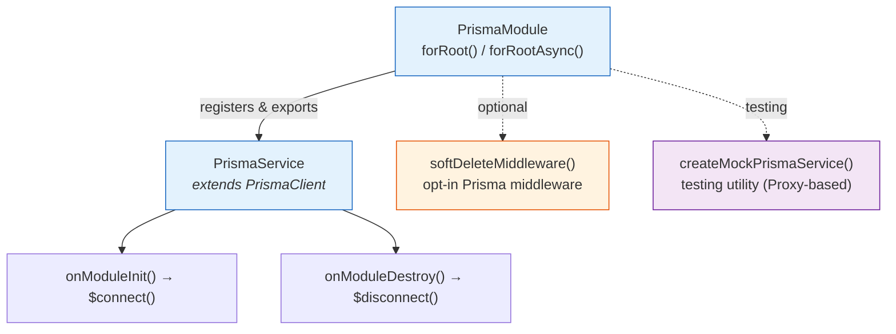

# @bbv/nestjs-prisma

> NestJS Prisma module with lifecycle management, soft-delete middleware, and testing utilities.

## Overview

Wraps `PrismaClient` as a NestJS injectable service with automatic connection lifecycle (`onModuleInit` / `onModuleDestroy`). Ships a soft-delete middleware and a `createMockPrismaService()` factory that auto-generates mocked model delegates via `Proxy` for unit testing.

This is the **foundation** of the `@bbv/nestjs-plugins` ecosystem -- all Tier 1 plugin modules depend on `PrismaService`.

## Installation

```bash
npm install @bbv/nestjs-prisma
```

### Peer Dependencies

| Package | Version |
|---------|---------|
| `@nestjs/common` | `^10.0.0` |
| `@nestjs/core` | `^10.0.0` |
| `@prisma/client` | `^5.0.0 \|\| ^6.0.0` |

## Quick Start

```typescript
import { Module } from '@nestjs/common';
import { PrismaModule } from '@bbv/nestjs-prisma';

@Module({
  imports: [
    PrismaModule.forRoot({ isGlobal: true }),
  ],
})
export class AppModule {}
```

Then inject `PrismaService` anywhere:

```typescript
import { Injectable } from '@nestjs/common';
import { PrismaService } from '@bbv/nestjs-prisma';

@Injectable()
export class UserService {
  constructor(private readonly prisma: PrismaService) {}

  findAll() {
    return this.prisma.user.findMany();
  }
}
```

## Configuration

### `PrismaModule.forRoot(options?)`

| Option | Type | Default | Description |
|--------|------|---------|-------------|
| `isGlobal` | `boolean` | `false` | Register module globally (no re-imports needed) |
| `prismaServiceOptions.explicitConnect` | `boolean` | `false` | Skip auto-connect on module init |
| `prismaServiceOptions.middlewares` | `Function[]` | `[]` | Prisma middlewares to register |

### `PrismaModule.forRootAsync(options)`

| Option | Type | Description |
|--------|------|-------------|
| `isGlobal` | `boolean` | Register module globally |
| `imports` | `any[]` | Modules to import (e.g. `ConfigModule`) |
| `useFactory` | `(...args) => PrismaModuleOptions` | Factory function returning options |
| `inject` | `any[]` | Providers to inject into factory |

```typescript
PrismaModule.forRootAsync({
  isGlobal: true,
  imports: [ConfigModule],
  useFactory: (config: ConfigService) => ({
    prismaServiceOptions: {
      middlewares: [softDeleteMiddleware()],
    },
  }),
  inject: [ConfigService],
})
```

## API Reference

### `PrismaService`

Extends `PrismaClient` and implements NestJS lifecycle hooks.

| Method | Description |
|--------|-------------|
| `onModuleInit()` | Connects to the database via `$connect()` |
| `onModuleDestroy()` | Disconnects via `$disconnect()` |

All standard Prisma Client methods (`findMany`, `create`, `$transaction`, etc.) are available directly on the service.

### `softDeleteMiddleware()`

Prisma middleware that converts `delete` / `deleteMany` operations into soft deletes by setting a `deletedAt` timestamp. Automatically filters soft-deleted records from `findFirst`, `findMany`, `findUnique`, and `count` queries.

**Requirement**: Models using soft delete must have a `deletedAt DateTime?` field.

```typescript
import { softDeleteMiddleware } from '@bbv/nestjs-prisma';

// With Prisma $use middleware (< v6)
prisma.$use(softDeleteMiddleware());
```

**Intercepted operations**:

| Original Action | Converted To | Behavior |
|----------------|--------------|----------|
| `delete` | `update` | Sets `deletedAt = new Date()` |
| `deleteMany` | `updateMany` | Sets `deletedAt = new Date()` |
| `findFirst` / `findMany` / `findUnique` | unchanged | Adds `WHERE deletedAt IS NULL` |
| `count` | unchanged | Adds `WHERE deletedAt IS NULL` |

You can still query soft-deleted records explicitly:

```typescript
// This will NOT be filtered -- explicit deletedAt query
prisma.user.findMany({ where: { deletedAt: { not: null } } });
```

## Testing

### `createMockPrismaService()`

Creates a deeply mocked `PrismaService` for unit testing. Uses a `Proxy` to auto-generate model delegates on first access -- no need to declare every model upfront.

```typescript
import { Test } from '@nestjs/testing';
import { PrismaService } from '@bbv/nestjs-prisma';
import { createMockPrismaService, MockPrismaService } from '@bbv/nestjs-prisma';

describe('UserService', () => {
  let service: UserService;
  let prisma: MockPrismaService;

  beforeEach(async () => {
    prisma = createMockPrismaService();

    const module = await Test.createTestingModule({
      providers: [
        UserService,
        { provide: PrismaService, useValue: prisma },
      ],
    }).compile();

    service = module.get(UserService);
  });

  it('should find a user', async () => {
    prisma.user.findUnique.mockResolvedValue({ id: '1', email: 'test@test.com' });

    const user = await service.findById('1');
    expect(user.email).toBe('test@test.com');
  });

  it('should support transactions', async () => {
    prisma.$transaction.mockImplementation((fn) => fn(prisma));
    // transaction callback receives the same mock instance
  });
});
```

**Mocked client methods**: `$connect`, `$disconnect`, `$transaction`, `$queryRaw`, `$executeRaw`, `$on`, `$use`, `onModuleInit`, `onModuleDestroy`.

**Auto-generated model methods** (per model delegate): `findUnique`, `findUniqueOrThrow`, `findFirst`, `findFirstOrThrow`, `findMany`, `create`, `createMany`, `update`, `updateMany`, `delete`, `deleteMany`, `upsert`, `count`, `aggregate`, `groupBy`.

## Architecture



## License

[MIT](../../LICENSE) -- [BlackBox Vision](https://github.com/BlackBoxVision)
